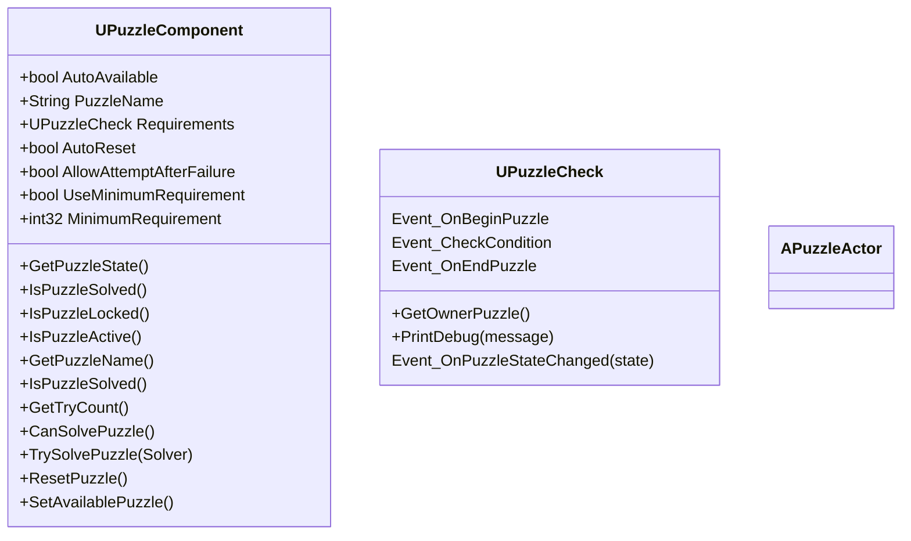
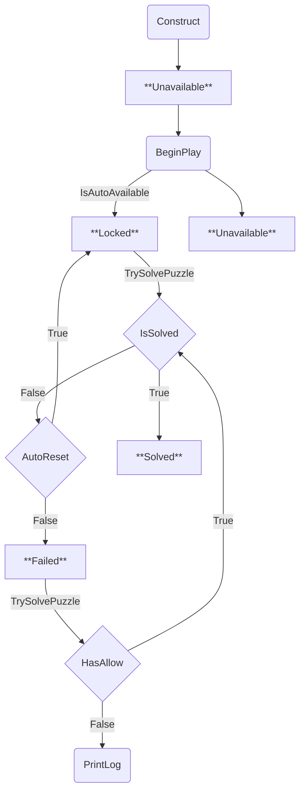

# PuzzleCore
 

`PuzzleCore` is a minimal, modular puzzle framework for `UnrealEngine`, designed to simplify implementing puzzle logic in both offline and online multiplayer games.

The system focuses on clear separation of logic, data-driven conditions, and network-friendly design, making it suitable for small indie projects as well as scalable multiplayer experiences.

## Concepts
1. PuzzleComponent
`UPuzzleComponent` is the main component you attach to an Actor, each puzzle is a component and when solved that all condition is true you can define condition witth `UPuzzleCheck` class
    * PuzzleComponentState:
    1. Unavailable: Your puzzle not active
    2. Locked: Your puzzle is active but still not try to solve
    3. Solved: Your puzzle is solved
    4. Failed: Your puzzle try befor and after that can't solved
2. PuzzleCheck
`UPuzzleCheck` is a `UObject` calss that has 



#### In short:
* PuzzleComponent = puzzle manager / brain
* PuzzleCheck = individual rules / sensors / validators
>They are designed to separate core logic from individual conditions, making the system flexible, modular, and multiplayer-safe.


## Features
1. Server-authoritative puzzle logic
All puzzle state and solve logic run on the server for multiplayer safety.
2. Offline-friendly
Works seamlessly in single-player / standalone games with zero network overhead.
3. Flexible Requirements
Attach UPuzzleCheck objects to define custom conditions to solve a puzzle.
4. Minimal Blueprint exposure
Use the component in Blueprints, but core logic remains in C++ for performance and security.
5. Events & Delegates
Listen to puzzle state changes via:
    1. OnStateChanged
    2. OnSolved
    3. OnFailed
    4. OnReset
6. Automatic handling
Optional features:
    1. Auto-reset after fail
    2. Allow attempts after failure
    3. Minimum requirements mode

## Getting Started
1. Add `UPuzzleComponent` to your Actor or Use `PuzzleActor`
2. Assign your `UPuzzleCheck` instances in the Requirements array.
3. Use the exposed Blueprint or C++ API to attempt puzzle solving

#### C++ Example
```
PuzzleComponent->TrySolvePuzzle(Solver);
````
>Note: TrySolvePuzzle must be called on the server or via client request routing (e.g., through PlayerController RPC).

## Requirements
* Unreal Engine 5.6+
* No external dependencies

## Usage Notes
* UPuzzleCheck is instanced and editable per actor.
* Puzzle state is replicated automatically for multiplayer.
* For Online the component only work in Server and client just updated states puzzle.


