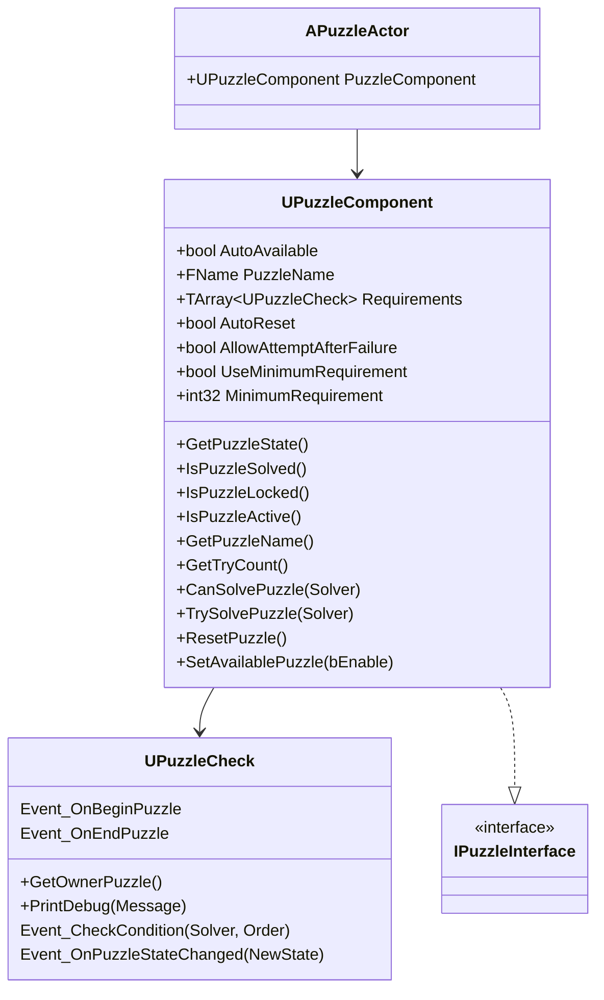
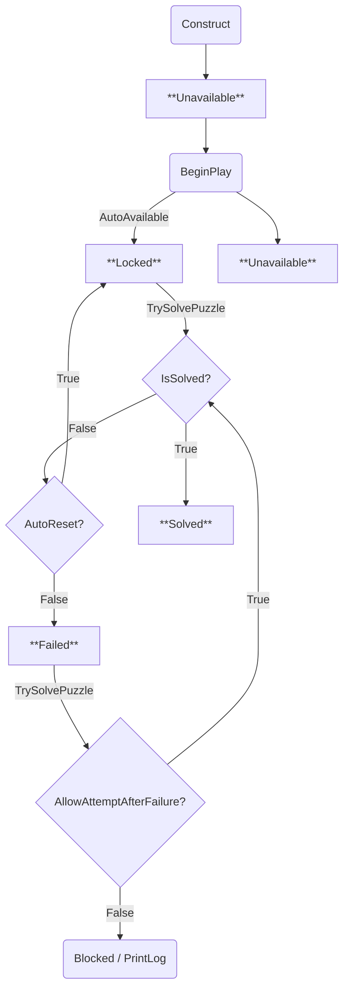

# PuzzleCore

<p align="center">
  
</p>

<p align="center">
  <b>A minimal, modular puzzle framework for Unreal Engine</b><br/>
  Build offline and network-ready multiplayer puzzles with clean, data-driven logic.
</p>

<p align="center">
  
  
  
</p>

---

## Overview

**PuzzleCore** is a lightweight Unreal Engine plugin that gives you a clean, reusable foundation for building puzzles of any kind — pressure plates, item collection, trigger sequences, environmental riddles, escape-room mechanics, and more.

It focuses on:

- **Separation of concerns** — puzzle state management is decoupled from the individual rules that define "solved."
- **Data-driven conditions** — solving logic is expressed as small, reusable `UPuzzleCheck` objects instead of hardcoded per-puzzle code.
- **Multiplayer safety** — puzzle state runs authoritatively on the server and replicates automatically, while still working seamlessly offline.
- **Blueprint & C++ friendly** — core logic lives in C++ for performance and security, while checks and events are fully exposed to Blueprints.

---

## Core Concepts

### `UPuzzleComponent`
The main component you attach to any Actor (or use via the provided `APuzzleActor`). It manages the puzzle's lifecycle, tracks its state, and evaluates the assigned requirements when someone attempts to solve it.

**Puzzle states**

| State | Meaning |
|---|---|
| `Unavailable` | The puzzle isn't active yet. |
| `Locked` | The puzzle is active and waiting to be solved. |
| `Solved` | The puzzle's requirements have all been met. |
| `Failed` | A solve attempt failed and further attempts are blocked (unless `AllowAttemptAfterFailure` is enabled). |

### `UPuzzleCheck`
An abstract, instanced `UObject` that represents a single condition/rule (e.g. "is the solver inside this trigger?", "was this actor found?", "did this sequence finish playing?"). A puzzle can hold one or many checks, and every check is evaluated when someone tries to solve the puzzle.


```mermaid
classDiagram
    class UPuzzleComponent {
        +bool AutoAvailable
        +FName PuzzleName
        +TArray~UPuzzleCheck~ Requirements
        +bool AutoReset
        +bool AllowAttemptAfterFailure
        +bool UseMinimumRequirement
        +int32 MinimumRequirement
        +GetPuzzleState()
        +IsPuzzleSolved()
        +IsPuzzleLocked()
        +IsPuzzleActive()
        +GetPuzzleName()
        +GetTryCount()
        +CanSolvePuzzle(Solver)
        +TrySolvePuzzle(Solver)
        +ResetPuzzle()
        +SetAvailablePuzzle(bEnable)
    }
    class UPuzzleCheck {
        +GetOwnerPuzzle()
        +PrintDebug(Message)
        Event_OnBeginPuzzle
        Event_CheckCondition(Solver, Order)
        Event_OnEndPuzzle
        Event_OnPuzzleStateChanged(NewState)
    }
    class APuzzleActor {
        +UPuzzleComponent PuzzleComponent
    }
    class IPuzzleInterface {
        <<interface>>
    }
    APuzzleActor --> UPuzzleComponent
    UPuzzleComponent --> UPuzzleCheck
    UPuzzleComponent ..|> IPuzzleInterface
```

**In short:**
- `UPuzzleComponent` = the puzzle manager / brain.
- `UPuzzleCheck` = an individual rule, sensor, or validator.
- `IPuzzleInterface` = a lightweight C++ interface exposing the puzzle's read/solve API (`GetPuzzleState`, `TrySolve`, `CanSolve`, `ResetPuzzle`, …) for code that shouldn't depend on the concrete component type.

They're designed to keep core logic separate from individual conditions, making the system flexible, modular, and multiplayer-safe.

---

## Features

- **Server-authoritative logic** — all puzzle state and solving logic run on the server; clients only receive replicated state updates.
- **Offline-friendly** — works out of the box in single-player/standalone games with zero networking overhead.
- **Flexible requirements** — attach any number of `UPuzzleCheck` objects to define custom, reusable solving conditions.
- **Minimum requirement mode** — optionally solve a puzzle once *N* out of all checks pass, instead of requiring every single one.
- **Minimal Blueprint exposure** — use and configure the component fully in Blueprints while the core stays in C++.
- **Events & delegates** — react to puzzle changes via:
  - `OnStateChanged`
  - `OnSolved`
  - `OnFailed`
  - `OnReset`
- **Automatic handling options**
  - Auto-reset after a failed attempt
  - Allow/deny further attempts after failure
  - Attempt counter (`GetTryCount`)
- **`PrePuzzleCheck`** — a `BlueprintNativeEvent` hook to add custom, game-specific validation before requirements are evaluated.
- **Built-in debug logging** — toggle per-check on-screen/log messages via `PrintDebug` and the `LOG` / `PRINT` macros.

---

## Included Example Puzzle Checks

The plugin ships with a set of ready-to-use Blueprint `PuzzleCheck` examples (found under `Content/PuzzleCheck`) that cover common puzzle patterns:

- `BP_FindActor_PuzzleCheck` — solved when a specific actor is found/referenced.
- `BP_IsHitCollider_PuzzleCheck` — solved when a collider is hit.
- `BP_IsInRadius_PuzzleCheck` — solved when an actor is within a given radius.
- `BP_IsInTrace_PuzzleCheck` — solved based on a line/shape trace result.
- `BP_IsInTrigger_PuzzleCheck` — solved while inside a trigger volume.
- `BP_IsPassTrigger_PuzzleCheck` — solved after passing through a trigger.
- `BP_IsPuzzleSolved_PuzzleCheck` — solved when another `PuzzleComponent` has been solved (chaining puzzles together).
- `BP_IsSequenceFinished_PuzzleCheck` — solved when a Level Sequence finishes playing.
- `BP_IsSequencePlayed_PuzzleCheck` — solved once a Level Sequence has been played.
- `BP_IsSolverInRadius_PuzzleCheck` — solved when the solving object is within a radius.

Use these directly, or as reference for writing your own checks.

---

## Getting Started

### Installation

1. Copy the `PuzzleCore` folder into your project's `Plugins/` directory (create it if it doesn't exist):
   ```
   YourProject/Plugins/PuzzleCore/
   ```
2. Regenerate project files (if using a C++ project) and open the project.
3. Enable the plugin from **Edit → Plugins → Gameplay → PuzzleCore**, if it isn't already enabled.
4. Restart the editor if prompted.

### Basic Usage

1. Add a `UPuzzleComponent` to any Actor, or simply use the provided `APuzzleActor`, which already includes one.
2. In the component's **Requirements** array, add one or more `UPuzzleCheck` instances (built-in or custom) that define what "solved" means for this puzzle.
3. Configure the puzzle:
   - `AutoAvailable` — make it active as soon as the game starts.
   - `AutoReset` / `AllowAttemptAfterFailure` — control what happens on a failed attempt.
   - `UseMinimumRequirement` / `MinimumRequirement` — require only some checks to pass, instead of all of them.
4. Call `TrySolvePuzzle(Solver)` from gameplay code (e.g. on interact) to attempt to solve it.
5. Bind to `OnStateChanged`, `OnSolved`, `OnFailed`, or `OnReset` to react to the outcome (UI, VFX, unlocking doors, etc.).

#### C++ Example

```cpp
// Attempt to solve the puzzle
if (PuzzleComponent->TrySolvePuzzle(Solver))
{
    // Puzzle solved — trigger follow-up gameplay here
}
```

> **Note:** `TrySolvePuzzle` must be called on the server (or routed there via a client RPC, e.g. through the `PlayerController`) since puzzle logic is server-authoritative.

#### Writing a Custom `UPuzzleCheck`

Create a new class inheriting from `UPuzzleCheck` (C++ or Blueprint) and implement:

- `OnBeginPuzzle` — set up state/references when the puzzle begins.
- `CheckCondition(Solver, Order)` — return `true`/`false` depending on whether your condition is met.
- `OnEndPuzzle` — clean up when puzzle evaluation ends.
- `OnPuzzleStateChanged(NewState)` — react to the owning puzzle's state changes.

Use `GetOwnerPuzzle()` to access the owning `UPuzzleComponent`, and `PrintDebug(Message)` for quick debug feedback.

---

## Puzzle State Flow


```mermaid
flowchart TD
    CC(Construct) --> SU[**Unavailable**]
    SU --> BP(BeginPlay)
    BP -->|AutoAvailable| SL[**Locked**]
    BP --> SU2[**Unavailable**]
    SL -->|TrySolvePuzzle| H{IsSolved?}
    H -->|False| H2{AutoReset?}
    H -->|True| SS[**Solved**]
    H2 -->|False| SF[**Failed**]
    H2 -->|True| SL
    SF -->|TrySolvePuzzle| H3{AllowAttemptAfterFailure?}
    H3 -->|True| H
    H3 -->|False| BB(Blocked / PrintLog)
```

---

## Requirements

- Unreal Engine **5.6+**
- No external dependencies

## Usage Notes

- `UPuzzleCheck` instances are instanced and editable per-actor (`EditInlineNew` / `Instanced`).
- Puzzle state and try count are replicated automatically for multiplayer.
- In networked games, solving logic only runs on the server; clients simply receive the replicated state.

---

## License

This project is licensed under the **MIT License** — see [LICENSE](LICENSE) for details.

## Author

Created by **Ali Badpa** ([alibadpa.weebly.com](https://alibadpa.weebly.com/))
Contact: alibadpa007@gmail.com
